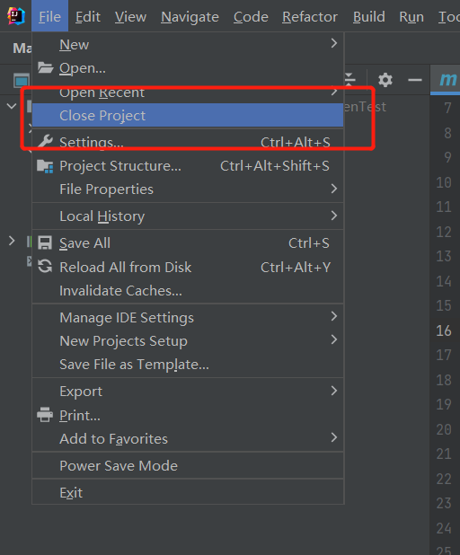
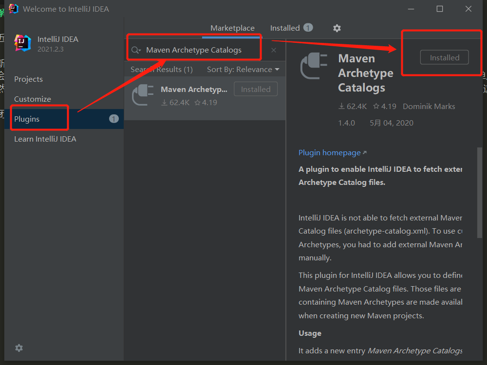
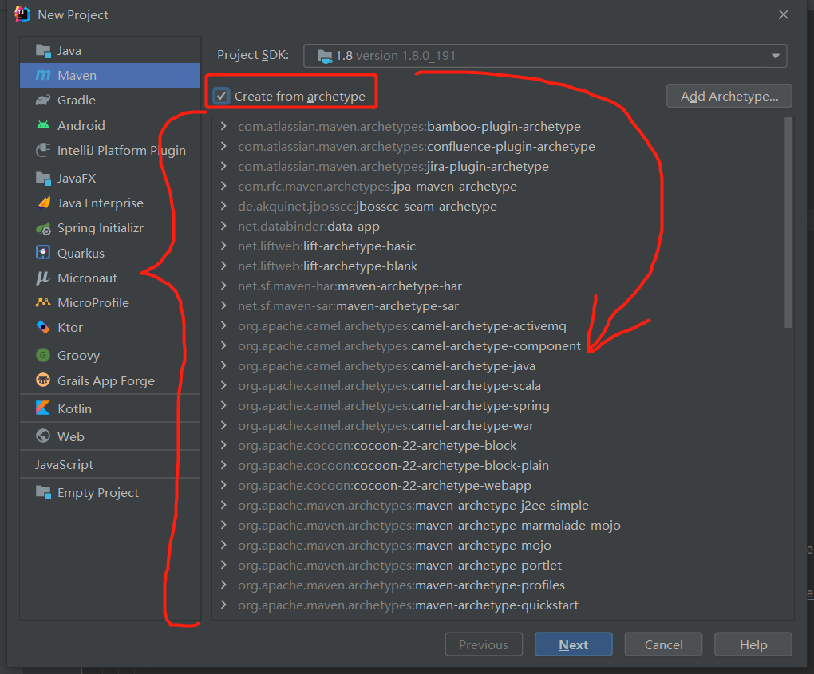

# 解决 IDEA 2021.2.3 新建maven项目只有两个archetype项目模板的问题  

最近把我的 IDEA 版本更新到 2021.2.3 了，发生了一个比较有意思的问题，做个小小的记录

### 思路分析
在新的 IDEA 中配置完Maven之后，想要创建Maven项目的时候没有自动加载archetype项目模板的列表了，
只会出现两个Kotlin的项目模板。所以出现这个问题的时候我愣了一下，因为老版的可是有几十个模板啊，接着简单思考一下：
既然没有出来，说明软件的内部没有内置模板，那么作为一个插件极其丰富的软件，我们是不是可以查找一下是否有这种插件？

### 解决步骤
1. 关闭当前项目，左上角`File -> Close Project`  

  

2. 点击欢迎界面左侧的`Plugin`选项，搜索`Maven Archetype Catalogs`安装  

  

3. 之后再新建Maven项目的时候应该就没有问题了  

  

#### 在我们工作中会遇到无数的问题，有些时候，找到解决思路往往想着解决问题更为重要  

我是 [fx67ll.com](https://fx67ll.com)，如果您发现本文有什么错误，欢迎在评论区讨论指正，感谢您的阅读！  
如果您喜欢这篇文章，欢迎访问我的 [本文github仓库地址](https://github.com/fx67ll/fx67llJava/blob/main/java-blog/2021/2021-11/idea-archetype.md)，为我点一颗Star，Thanks~ :)  
***转发请注明参考文章地址，非常感谢！！！***