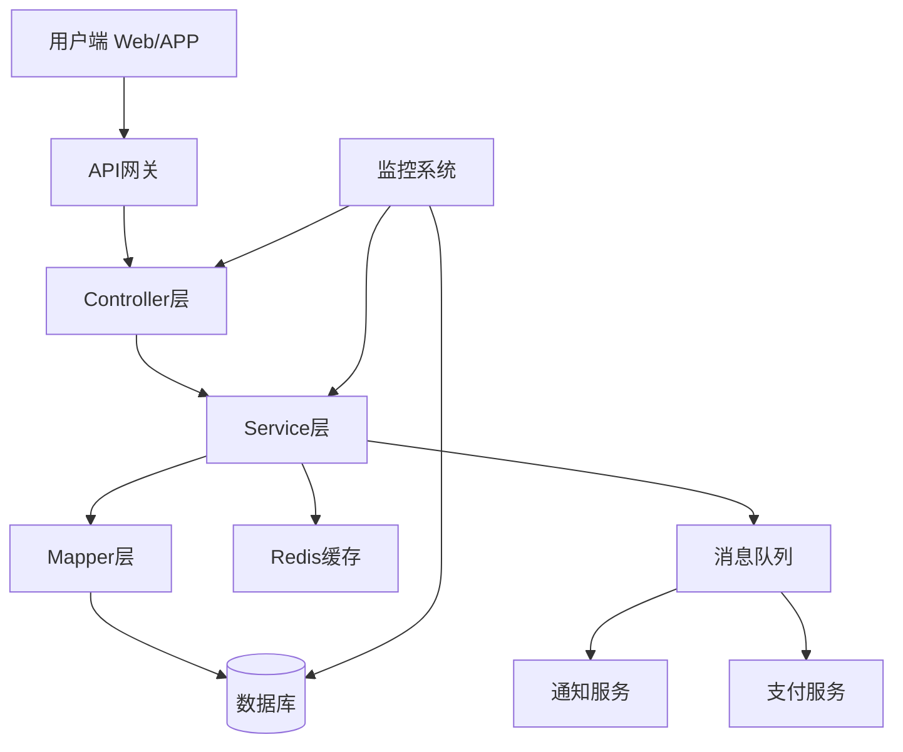
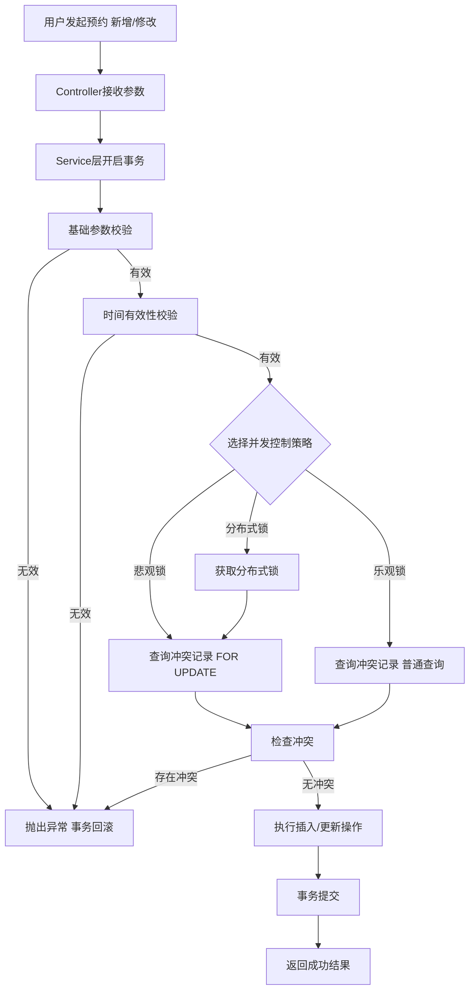
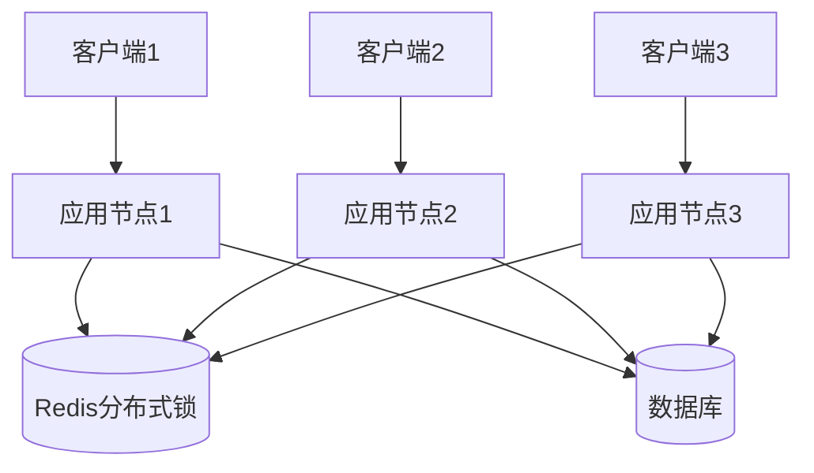
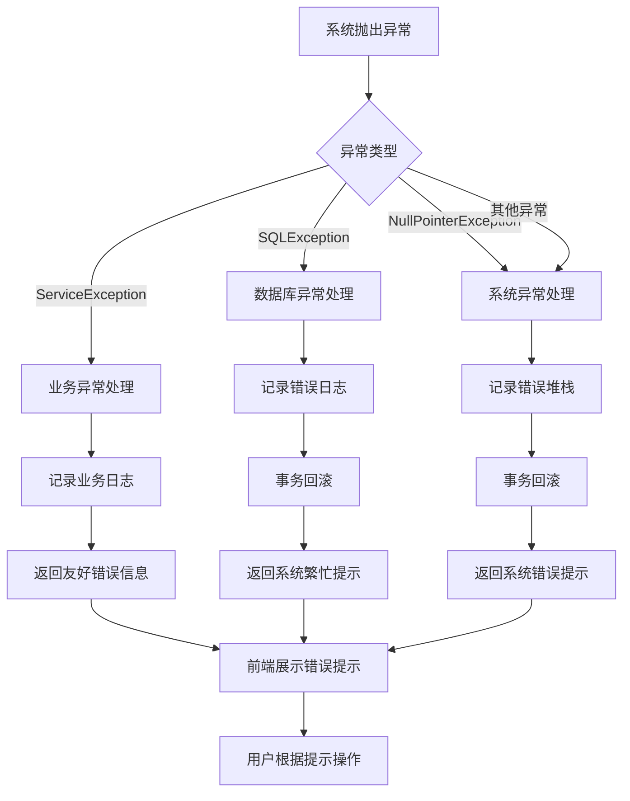
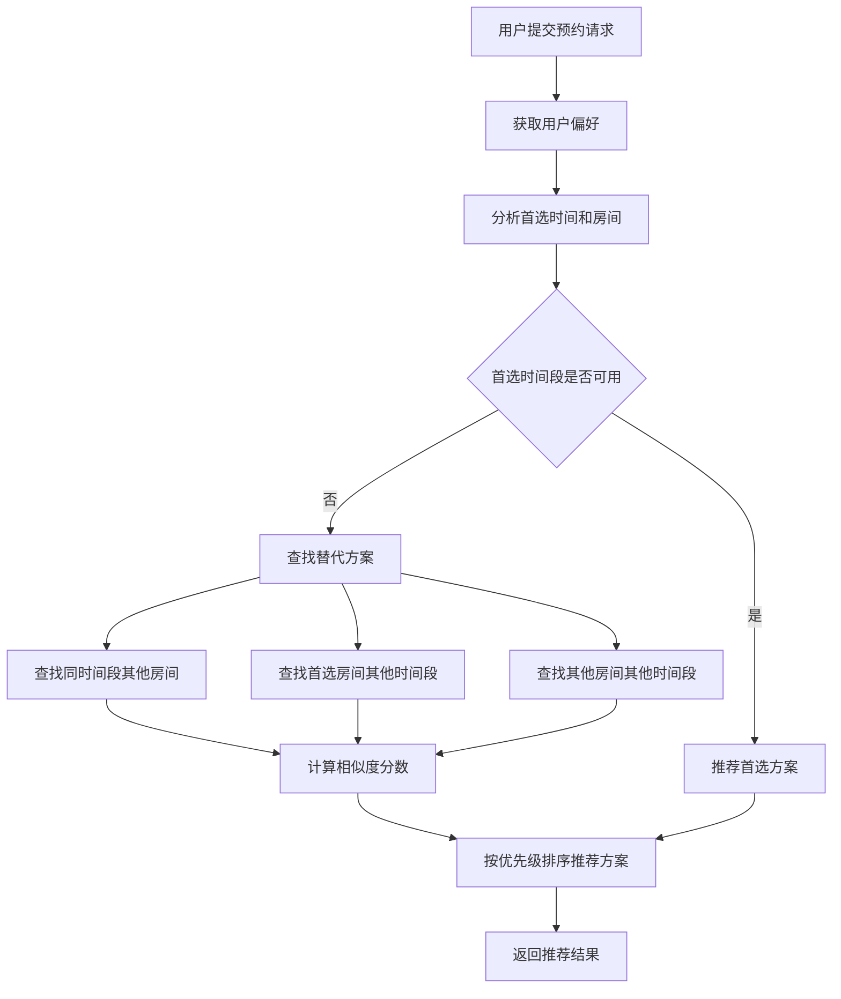
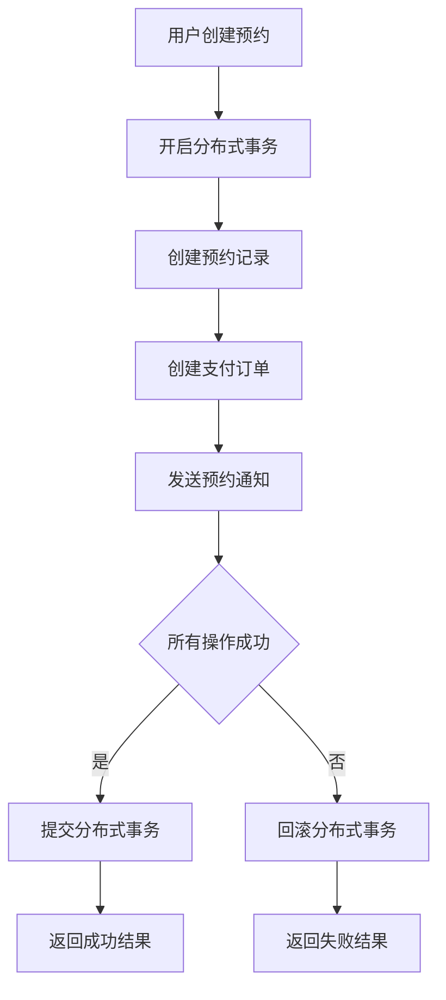
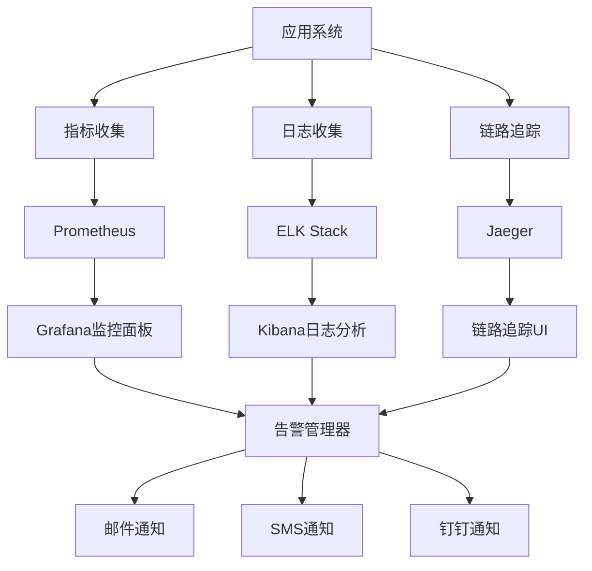

# 麻将室预约系统：时间段冲突与并发安全解决方案深度解析

## 引言

在日常开发中，我们遇到了一个典型的并发场景问题：**如何确保同一麻将室在同一时间段内不会被多个用户重复预约**。

这个问题看似简单，但涉及到数据一致性、并发控制、业务逻辑等多个层面的考量。

本文将深入剖析这个问题的解决方案，包括多种并发控制机制的实现细节、性能对比、适用场景分析，以及在实际项目中的最佳实践，为类似系统的开发提供完整的技术参考。

## 业务场景分析

### 核心业务流程

我们的麻将室预约系统支持 Web 端和 APP 端，核心功能包括：

- 用户可以查看麻将室列表和可用时间段
- 选择时间段进行预约
- 修改或取消已有的预约
- 管理员可以管理所有预约记录

### 系统架构设计



### 关键实体设计

核心实体为`fx67ll_mahjong_reservation_log`（预约记录表），主要字段包括：

| 字段名                          | 类型          | 说明                  |
| ---------------------------- | ----------- | ------------------- |
| `mahjong_reservation_log_id` | BIGINT      | 预约记录 ID             |
| `user_id`                    | BIGINT      | 用户 ID               |
| `mahjong_room_id`            | BIGINT      | 麻将室 ID              |
| `reservation_start_time`     | DATETIME    | 预约开始时间              |
| `reservation_end_time`       | DATETIME    | 预约结束时间              |
| `reservation_status`         | CHAR(1)     | 预约状态（0 - 正常，1 - 取消） |
| `del_flag`                   | CHAR(1)     | 删除标志（0 - 正常，2 - 删除） |
| `create_by`                  | VARCHAR(64) | 创建人                 |
| `create_time`                | DATETIME    | 创建时间                |
| `update_by`                  | VARCHAR(64) | 更新人                 |
| `update_time`                | DATETIME    | 更新时间                |
| `version`                    | INT         | 版本号（乐观锁）            |

## 核心问题识别

在系统测试和实际使用过程中，我们发现了以下几个关键问题：

### 1. 时间段重叠冲突

**问题描述**：用户可以预约与已有预约重叠的时间段，导致资源冲突。

**示例**：

- 已有预约：18:00-20:00
- 新预约：19:00-21:00
- 结果：两个预约时间重叠，同一麻将室无法同时容纳两批用户

### 2. 无效时间数据

**问题描述**：用户可以提交逻辑上无效的时间数据。

**示例**：

- 结束时间早于开始时间：2025-11-13 00:00:00 - 2025-11-12 03:00:00
- 开始时间等于结束时间：18:00:00 - 18:00:00

### 3. 并发安全风险

**问题描述**：在高并发场景下，多个用户同时预约同一时间段，可能出现 "漏判" 情况。

**并发问题流程图**：

```text
sequenceDiagram
    participant UserA
    participant UserB
    participant System
    participant Database
    
    UserA->>System: 查询18:00-20:00是否可用
    UserB->>System: 查询18:00-20:00是否可用
    
    System->>Database: SELECT * FROM reservations WHERE room=1 AND time conflicts
    Database-->>System: 无冲突记录
    System->>Database: SELECT * FROM reservations WHERE room=1 AND time conflicts
    Database-->>System: 无冲突记录
    
    System-->>UserA: 时间段可用
    System-->>UserB: 时间段可用
    
    UserA->>System: 提交预约
    UserB->>System: 提交预约
    
    System->>Database: INSERT INTO reservations (...)
    System->>Database: INSERT INTO reservations (...)
    
    Database-->>System: 插入成功
    Database-->>System: 插入成功
    
    System-->>UserA: 预约成功
    System-->>UserB: 预约成功
```

### 4. 业务合规性要求

**核心要求**：

- 允许相邻时间段预约（如 18:00-19:00 与 19:00-20:00）
- 排除已取消和已删除的记录
- 修改预约时需要排除自身记录

## 整体解决方案流程



## 并发控制机制深度解析

### 1. 悲观锁机制

#### 原理分析

悲观锁（Pessimistic Locking）是一种并发控制策略，它假设冲突总是会发生，因此在数据操作前就对数据进行锁定，直到操作完成才释放锁。

**核心特点**：

- 操作前锁定，操作后释放
- 阻塞其他事务的并发操作
- 实现简单，逻辑清晰
- 可能导致性能问题和死锁

#### 悲观锁工作流程

```text
sequenceDiagram
    participant T1 as 事务1
    participant T2 as 事务2
    participant DB as 数据库
    
    T1->>DB: BEGIN TRANSACTION
    T2->>DB: BEGIN TRANSACTION
    
    T1->>DB: SELECT * FROM reservations WHERE room=1 FOR UPDATE
    DB-->>T1: 锁定记录，返回结果
    
    T2->>DB: SELECT * FROM reservations WHERE room=1 FOR UPDATE
    note over T2,DB: T2被阻塞等待
    
    T1->>DB: INSERT INTO reservations (...)
    DB-->>T1: 插入成功
    T1->>DB: COMMIT
    note over DB: 释放锁
    
    DB-->>T2: 返回结果（包含T1的新记录）
    T2->>DB: 检查冲突，发现已被预约
    T2->>DB: ROLLBACK
```

#### 数据库悲观锁实现

在 MySQL 中，我们可以通过`SELECT ... FOR UPDATE`语句实现行级锁定：

```sql
-- 悲观锁查询示例
SELECT * FROM fx67ll_mahjong_reservation_log 
WHERE mahjong_room_id = 1 
AND reservation_start_time < '2025-11-13 20:00:00'
AND reservation_end_time > '2025-11-13 18:00:00'
FOR UPDATE;
```

**锁定行为分析**：

- InnoDB 存储引擎会对查询结果集中的每行数据加行级锁
- 锁会一直持有到事务结束（COMMIT 或 ROLLBACK）
- 如果其他事务尝试修改被锁定的行，会被阻塞等待
- 锁定范围取决于查询条件和索引使用情况

#### 实现代码

```java
@Service
public class PessimisticLockReservationService {

    @Autowired
    private Fx67llMahjongReservationLogMapper reservationMapper;

    @Transactional(rollbackFor = Exception.class)
    public void createReservation(Fx67llMahjongReservationLog log) {
        // 1. 悲观锁查询冲突记录
        List<Fx67llMahjongReservationLog> conflicts = reservationMapper.selectConflictingReservationsWithLock(
            log.getMahjongRoomId(), 
            log.getReservationStartTime(), 
            log.getReservationEndTime()
        );

        // 2. 检查冲突
        if (!conflicts.isEmpty()) {
            throw new ServiceException("该时间段已被预约");
        }

        // 3. 创建新预约
        reservationMapper.insert(log);
    }
}
```

```xml
<!-- MyBatis 映射文件 -->
<select id="selectConflictingReservationsWithLock" resultMap="BaseResultMap">
    SELECT * FROM fx67ll_mahjong_reservation_log
    WHERE mahjong_room_id = #{roomId}
    AND del_flag = '0'
    AND reservation_status != '1'
    AND #{endTime} > reservation_start_time
    AND #{startTime} < reservation_end_time
    FOR UPDATE;
</select>
```

#### 性能分析

**优点**：

- 实现简单，易于理解
- 能够完全避免并发冲突
- 适合冲突率较高的场景

**缺点**：

- 可能导致性能问题，特别是在高并发场景
- 可能出现死锁
- 长时间持有锁会影响系统吞吐量

### 2. 乐观锁机制

#### 原理分析

乐观锁（Optimistic Locking）假设冲突很少发生，因此不主动锁定数据，而是在更新时检查数据是否被其他事务修改过。

**核心特点**：

- 操作前不锁定，更新时检查
- 不阻塞其他事务的并发操作
- 性能较好，适合高并发场景
- 需要处理冲突重试逻辑

#### 乐观锁工作流程

```text
sequenceDiagram
    participant T1 as 事务1
    participant T2 as 事务2
    participant DB as 数据库
    
    T1->>DB: BEGIN TRANSACTION
    T2->>DB: BEGIN TRANSACTION
    
    T1->>DB: SELECT * FROM reservations WHERE room=1
    DB-->>T1: 返回记录（version=1）
    T2->>DB: SELECT * FROM reservations WHERE room=1
    DB-->>T2: 返回记录（version=1）
    
    T1->>DB: UPDATE reservations SET ..., version=2 WHERE id=1 AND version=1
    DB-->>T1: 更新成功（1 row affected）
    
    T2->>DB: UPDATE reservations SET ..., version=2 WHERE id=1 AND version=1
    DB-->>T2: 更新失败（0 rows affected）
    
    T1->>DB: COMMIT
    T2->>DB: ROLLBACK
    T2->>T2: 重试逻辑或返回错误
```

#### 实现方式对比

| 实现方式       | 原理                    | 优点       | 缺点       |
| ---------- | --------------------- | -------- | -------- |
| **版本号机制**  | 添加 version 字段，更新时检查版本 | 实现简单，性能好 | 需要额外字段   |
| **时间戳机制**  | 使用最后修改时间戳             | 不需要额外字段  | 可能存在精度问题 |
| **字段比较机制** | 比较所有字段的原值             | 不需要额外字段  | 实现复杂，性能差 |

#### 版本号机制实现

**数据库表设计**：

```sql
ALTER TABLE fx67ll_mahjong_reservation_log 
ADD COLUMN version INT DEFAULT 1 NOT NULL;
```

**Java 实体类**：

```java
public class Fx67llMahjongReservationLog {
    // 其他字段...
    private Integer version;

    // getter 和 setter
}
```

**Service 层实现**：

```java
@Service
public class OptimisticLockReservationService {

    @Autowired
    private Fx67llMahjongReservationLogMapper reservationMapper;

    @Transactional(rollbackFor = Exception.class)
    public void updateReservation(Fx67llMahjongReservationLog log) {
        int retryCount = 0;
        final int MAX_RETRY = 3;

        while (retryCount < MAX_RETRY) {
            try {
                // 1. 查询当前记录（获取版本号）
                Fx67llMahjongReservationLog current = reservationMapper.selectById(log.getId());
                if (current == null) {
                    throw new ServiceException("记录不存在");
                }

                // 2. 设置版本号（用于乐观锁检查）
                log.setVersion(current.getVersion());

                // 3. 检查时间段冲突
                checkTimeConflict(log);

                // 4. 更新记录（包含版本号检查）
                int affectedRows = reservationMapper.updateWithVersion(log);

                // 5. 检查更新结果
                if (affectedRows > 0) {
                    // 更新成功，退出重试
                    return;
                }

                // 6. 更新失败，重试
                retryCount++;
                if (retryCount >= MAX_RETRY) {
                    throw new ServiceException("更新失败，请稍后重试");
                }

                // 短暂延迟后重试
                Thread.sleep(100);

            } catch (InterruptedException e) {
                Thread.currentThread().interrupt();
                throw new ServiceException("操作被中断");
            }
        }
    }

    private void checkTimeConflict(Fx67llMahjongReservationLog log) {
        List<Fx67llMahjongReservationLog> conflicts = reservationMapper.selectConflictingReservations(
            log.getMahjongRoomId(),
            log.getReservationStartTime(),
            log.getReservationEndTime(),
            log.getId() // 排除自身
        );

        if (!conflicts.isEmpty()) {
            throw new ServiceException("该时间段已被预约");
        }
    }
}
```

```xml
<!-- MyBatis 更新语句 -->
<update id="updateWithVersion">
    UPDATE fx67ll_mahjong_reservation_log
    SET 
        reservation_start_time = #{reservationStartTime},
        reservation_end_time = #{reservationEndTime},
        version = version + 1,
        update_time = NOW()
    WHERE 
        mahjong_reservation_log_id = #{mahjongReservationLogId}
        AND version = #{version}
</update>
```

#### 性能分析

**优点**：

- 高并发性能好，不会阻塞其他事务
- 资源利用率高
- 适合读多写少的场景

**缺点**：

- 实现复杂，需要处理重试逻辑
- 在冲突频繁的场景下性能反而更差
- 可能出现活锁

### 3. 分布式锁机制

#### 应用场景

当系统部署在多个节点（分布式环境）时，本地数据库锁无法跨节点生效，需要使用分布式锁。

**分布式环境下的并发问题**：

- 多个应用节点访问同一个数据库
- 本地锁只能控制单个节点的并发
- 不同节点间的并发无法控制

#### 分布式锁架构图



#### Redis 分布式锁实现

基于 Redis 的 SETNX 命令实现分布式锁：

```java
@Component
public class RedisDistributedLock {

    @Autowired
    private RedisTemplate<String, String> redisTemplate;

    private static final String LOCK_PREFIX = "reservation:lock:";
    private static final int DEFAULT_EXPIRE_TIME = 30; // 30秒

    public boolean tryLock(String key, String value, int expireTime) {
        String lockKey = LOCK_PREFIX + key;
        Boolean result = redisTemplate.opsForValue()
            .setIfAbsent(lockKey, value, expireTime, TimeUnit.SECONDS);
        return Boolean.TRUE.equals(result);
    }

    public void releaseLock(String key, String value) {
        String lockKey = LOCK_PREFIX + key;
        String currentValue = redisTemplate.opsForValue().get(lockKey);

        if (value.equals(currentValue)) {
            redisTemplate.delete(lockKey);
        }
    }
}
```

#### Redisson 分布式锁

Redisson 是一个基于 Redis 的 Java 驻内存数据网格，提供了更完善的分布式锁实现：

```java
@Component
public class RedissonDistributedLockService {

    @Autowired
    private RedissonClient redissonClient;

    public void createReservationWithDistributedLock(Fx67llMahjongReservationLog log) {
        String lockKey = "reservation:room:" + log.getMahjongRoomId();
        RLock lock = redissonClient.getLock(lockKey);

        try {
            // 尝试获取锁，最多等待5秒，锁自动释放时间30秒
            boolean locked = lock.tryLock(5, 30, TimeUnit.SECONDS);
            if (!locked) {
                throw new ServiceException("系统繁忙，请稍后重试");
            }

            // 执行业务逻辑
            doCreateReservation(log);

        } catch (InterruptedException e) {
            Thread.currentThread().interrupt();
            throw new ServiceException("操作被中断");
        } finally {
            // 释放锁
            if (lock.isHeldByCurrentThread()) {
                lock.unlock();
            }
        }
    }

    private void doCreateReservation(Fx67llMahjongReservationLog log) {
        // 检查冲突和创建预约的业务逻辑
        List<Fx67llMahjongReservationLog> conflicts = reservationMapper.selectConflictingReservations(
            log.getMahjongRoomId(),
            log.getReservationStartTime(),
            log.getReservationEndTime()
        );

        if (!conflicts.isEmpty()) {
            throw new ServiceException("该时间段已被预约");
        }

        reservationMapper.insert(log);
    }
}
```

#### Zookeeper 分布式锁

Zookeeper 也可以用于实现分布式锁，基于其节点特性：

```java
@Component
public class ZookeeperDistributedLock {

    private final CuratorFramework client;
    private final String lockPath;
    private String currentLockPath;

    public ZookeeperDistributedLock(CuratorFramework client, String lockPath) {
        this.client = client;
        this.lockPath = lockPath;
    }

    public void lock() throws Exception {
        // 创建临时顺序节点
        currentLockPath = client.create()
            .creatingParentsIfNeeded()
            .withMode(CreateMode.EPHEMERAL_SEQUENTIAL)
            .forPath(lockPath + "/lock-");

        // 检查是否获得锁
        while (true) {
            List<String> children = client.getChildren().forPath(lockPath);
            Collections.sort(children);

            if (currentLockPath.endsWith(children.get(0))) {
                // 获得锁
                return;
            }

            // 监听前一个节点
            String previousNode = children.get(children.indexOf(getLockName(currentLockPath)) - 1);
            CountDownLatch latch = new CountDownLatch(1);
            client.getData().usingWatcher((Watcher) event -> {
                if (event.getType() == Watcher.Event.EventType.NodeDeleted) {
                    latch.countDown();
                }
            }).forPath(lockPath + "/" + previousNode);

            latch.await();
        }
    }

    public void unlock() throws Exception {
        client.delete().forPath(currentLockPath);
    }

    private String getLockName(String path) {
        return path.substring(path.lastIndexOf("/") + 1);
    }
}
```

### 4. Zookeeper 的特性为什么适合实现分布式锁
ZooKeeper 作为分布式协调服务，其核心特性与分布式锁的核心需求（**互斥性、安全性、可用性、公平性**）高度契合，这使得它成为实现分布式锁的经典方案之一。要理解这一点，需要先拆解 ZooKeeper 的关键特性，并对应分析其如何满足分布式锁的设计要求。


#### 一、分布式锁的核心需求
在分析 ZooKeeper 特性前，需明确分布式锁必须解决的问题：
1. **互斥性**：同一时间只能有一个客户端持有锁，防止并发操作冲突。
2. **安全性**：锁必须正确释放（即使客户端崩溃），避免“死锁”。
3. **可用性**：锁服务需稳定（容忍部分节点故障），不能单点失效。
4. **公平性**：客户端获取锁的顺序应符合请求顺序，避免“饥饿”。
5. **可重入性（可选）**：同一客户端可多次获取同一把锁（需额外设计）。


#### 二、ZooKeeper 核心特性与分布式锁的适配性
ZooKeeper 的数据模型、节点特性、监听机制等，恰好针对性解决了分布式锁的需求，具体对应关系如下：


##### 1. 树形分层数据模型：天然的“锁路径”定义
ZooKeeper 的数据模型是**分布式文件系统风格的树形结构**，每个节点称为 `ZNode`，可类比为“目录/文件”，且每个 ZNode 有唯一的路径（如 `/locks/my-lock`）。  
- **适配锁需求**：可直接将“锁”映射为 ZooKeeper 中的一个指定 ZNode 路径（如 `/distributed-lock`），客户端通过“操作该路径下的子节点”来竞争锁，路径唯一性确保了“锁标识”的全局唯一性，避免不同锁的混淆。  
- **示例**：若要实现“订单服务的库存锁”，可定义根路径为 `/locks/inventory-lock`，所有竞争该锁的客户端均在该路径下创建临时节点。

##### 2. 临时节点（Ephemeral Node）：自动释放锁，避免死锁
ZooKeeper 的 ZNode 分为**持久节点（PERSISTENT）** 和**临时节点（EPHEMERAL）**，核心差异在于：  
- 临时节点的生命周期与客户端会话（Session）绑定：若客户端崩溃、网络断开导致会话超时，ZooKeeper 会**自动删除该临时节点**。  
- **适配锁需求**：将“持有锁”对应为“创建临时节点”——  
  - 客户端成功创建临时节点 → 持有锁；  
  - 客户端崩溃/会话超时 → 临时节点自动删除 → 锁释放，从根本上避免了“客户端崩溃导致锁无法释放”的死锁问题。  
- 对比传统方案（如 Redis 基于过期时间释放锁）：ZooKeeper 临时节点的释放是“会话级触发”，无需依赖人工设置的过期时间（避免过期时间过短导致锁误释放，或过长导致死锁），安全性更高。

##### 3. 顺序临时节点（Ephemeral_Sequential Node）：实现公平锁
ZooKeeper 支持创建**顺序节点（SEQUENTIAL）**：客户端创建顺序节点时，ZooKeeper 会自动在节点名后追加一个全局唯一的递增序号（如 `/locks/my-lock/lock-0000000001`、`lock-0000000002`）。结合“临时节点”特性，可实现**公平锁**：  
- 所有竞争锁的客户端，在同一锁路径（如 `/locks/my-lock`）下创建“顺序临时子节点”；  
- 客户端创建节点后，获取该路径下所有子节点并排序，判断自己的节点是否为“序号最小的节点”：  
  - 若是 → 成功获取锁；  
  - 若不是 → 监听“前一个序号更小的节点”（仅监听前一个，避免“惊群效应”）；  
- 当持有锁的客户端释放锁（节点被删除），后续监听的客户端会收到通知，重复判断自己是否为最小节点。  
- **核心优势**：严格按照“节点创建顺序”分配锁，完全满足公平性需求，且避免了 Redis 公平锁实现中“轮询消耗资源”的问题。

##### 4. 强一致性（CP 特性）：确保锁的正确性
ZooKeeper 基于 **ZAB 协议（ZooKeeper Atomic Broadcast）** 实现了强一致性：所有客户端对 ZNode 的读写操作，最终会在所有存活节点上达成一致状态（即使部分节点故障）。  
- **适配锁需求**：分布式锁的核心风险是“重复加锁”（如两个客户端同时认为自己持有锁），而 ZooKeeper 的强一致性确保：  
  - 同一时刻，只有一个客户端能创建“序号最小的临时节点”（即只有一个客户端能获取锁）；  
  - 客户端对锁状态的判断（是否持有、是否释放）基于全局一致的节点数据，不会出现“数据不一致导致的误判”。  
- 对比 Redis（AP 特性）：Redis 在主从切换时可能出现“数据同步延迟”，导致短暂的“锁重复分配”；而 ZooKeeper 即使有节点故障，只要集群中超过半数节点存活（如 3 节点集群存活 2 个），就能保证强一致性，锁的正确性更可靠。

##### 5. Watcher 监听机制：高效的锁释放通知
ZooKeeper 提供 **Watcher 机制**：客户端可对某个 ZNode 注册“监听”，当该节点发生变化（如删除、子节点新增/删除）时，ZooKeeper 会主动向客户端发送通知。  
- **适配锁需求**：无需客户端“轮询”查询锁状态（如 Redis 需定时发送 `GET` 命令判断锁是否释放），而是通过“被动通知”实现高效唤醒：  
  - 未获取到锁的客户端，仅监听“前一个节点”的删除事件；  
  - 当持有锁的节点删除（锁释放），监听客户端立即收到通知，进而尝试获取锁；  
- **优势**：减少无效网络请求，降低客户端和服务端的资源消耗，同时保证锁释放后能被快速竞争，提升锁的利用率。

##### 6. 集群高可用：避免锁服务单点故障
ZooKeeper 本身是**分布式集群架构**（通常部署 3/5/7 个节点），基于 ZAB 协议实现 leader-follower 模式：  
- 只有一个 leader 节点处理写请求，follower 节点同步数据并处理读请求；  
- 若 leader 故障，follower 会自动选举新的 leader，集群继续提供服务（只要存活节点数 > 集群节点数/2）；  
- **适配锁需求**：分布式锁服务不能依赖单点（否则单点故障会导致整个锁服务不可用），ZooKeeper 集群的高可用特性确保：即使部分节点故障，锁服务仍能稳定运行，满足分布式系统的可用性要求。


#### 三、ZooKeeper 分布式锁的典型实现流程
结合上述特性，ZooKeeper 分布式锁的标准实现（以公平锁为例）流程可总结为：
1. **创建锁根节点**：提前在 ZooKeeper 中创建一个持久节点作为锁的根路径（如 `/distributed-locks`），确保所有客户端都基于该路径竞争锁。
2. **客户端竞争锁**：客户端在根路径下创建“顺序临时子节点”（如 `/distributed-locks/lock-0000000001`）。
3. **判断是否持有锁**：客户端获取根路径下的所有子节点，按序号排序，检查自己创建的节点是否为序号最小的节点：
   - 若是 → 成功获取锁，执行业务逻辑。
   - 若不是 → 找到前一个序号更小的节点，为其注册“删除事件监听”，然后阻塞等待。
4. **锁释放与唤醒**：
   - 客户端执行完业务后，主动删除自己创建的临时节点（释放锁）；
   - 若客户端崩溃，会话超时后 ZooKeeper 自动删除该节点；
   - 前一个节点被删除后，监听它的客户端收到通知，重复步骤 3 判断是否持有锁。
5. **业务执行完成**：客户端释放锁后，流程结束。


#### 四、总结：ZooKeeper 适合分布式锁的核心原因
ZooKeeper 的特性与分布式锁需求形成了“一一对应”的解决方案，具体可概括为：
| ZooKeeper 特性               | 解决分布式锁的核心问题                     |
|------------------------------|--------------------------------------------|
| 树形数据模型                 | 定义全局唯一的锁标识（路径）               |
| 临时节点                     | 自动释放锁，避免死锁                       |
| 顺序临时节点                 | 实现公平锁，按请求顺序分配                 |
| 强一致性（ZAB 协议）         | 确保锁不重复分配，保证正确性               |
| Watcher 机制                 | 高效通知锁释放，避免轮询消耗               |
| 集群高可用                   | 避免锁服务单点故障，保证可用性             |

正是这些特性的协同作用，使得 ZooKeeper 实现的分布式锁在**安全性、公平性、可用性**上都达到了较高水准，成为分布式系统中解决并发冲突的重要方案（如 Hadoop、HBase 等大数据框架均基于 ZooKeeper 实现分布式锁）。


### 5. 各种锁机制对比分析

| 特性        | 悲观锁     | 乐观锁     | Redis 分布式锁 | Zookeeper 分布式锁 |
| --------- | ------- | ------- | ---------- | -------------- |
| **实现复杂度** | 简单      | 中等      | 中等         | 复杂             |
| **性能**    | 低       | 高       | 高          | 中              |
| **可靠性**   | 高       | 中       | 中          | 高              |
| **死锁风险**  | 可能      | 无       | 低          | 无              |
| **适用场景**  | 低并发、高冲突 | 高并发、低冲突 | 分布式、高并发    | 分布式、高可靠性       |
| **资源消耗**  | 高       | 低       | 中          | 高              |

## 完整解决方案实现

### 1. Mapper 层实现

```java
public interface Fx67llMahjongReservationLogMapper {

    // 基础CRUD方法
    int insert(Fx67llMahjongReservationLog record);
    Fx67llMahjongReservationLog selectByPrimaryKey(Long id);
    int updateByPrimaryKey(Fx67llMahjongReservationLog record);

    // 冲突查询方法
    List<Fx67llMahjongReservationLog> selectConflictingReservations(
        @Param("roomId") Long roomId,
        @Param("startTime") Date startTime,
        @Param("endTime") Date endTime,
        @Param("excludeId") Long excludeId);

    // 悲观锁查询方法
    List<Fx67llMahjongReservationLog> selectConflictingReservationsWithLock(
        @Param("roomId") Long roomId,
        @Param("startTime") Date startTime,
        @Param("endTime") Date endTime);

    // 乐观锁更新方法
    int updateWithVersion(Fx67llMahjongReservationLog record);
}
```

```xml
<?xml version="1.0" encoding="UTF-8"?>
<!DOCTYPE mapper PUBLIC "-//mybatis.org//DTD Mapper 3.0//EN" 
"http://mybatis.org/dtd/mybatis-3-mapper.dtd">
<mapper namespace="com.fx67ll.mapper.Fx67llMahjongReservationLogMapper">

    <resultMap id="BaseResultMap" type="com.fx67ll.domain.Fx67llMahjongReservationLog">
        <id column="mahjong_reservation_log_id" property="mahjongReservationLogId"/>
        <result column="user_id" property="userId"/>
        <result column="mahjong_room_id" property="mahjongRoomId"/>
        <result column="reservation_start_time" property="reservationStartTime"/>
        <result column="reservation_end_time" property="reservationEndTime"/>
        <result column="reservation_status" property="reservationStatus"/>
        <result column="del_flag" property="delFlag"/>
        <result column="create_by" property="createBy"/>
        <result column="create_time" property="createTime"/>
        <result column="update_by" property="updateBy"/>
        <result column="update_time" property="updateTime"/>
        <result column="version" property="version"/>
    </resultMap>

    <!-- 普通冲突查询 -->
    <select id="selectConflictingReservations" resultMap="BaseResultMap">
        SELECT * FROM fx67ll_mahjong_reservation_log
        WHERE mahjong_room_id = #{roomId}
        AND del_flag = '0'
        AND reservation_status != '1'
        AND #{endTime} > reservation_start_time
        AND #{startTime} < reservation_end_time
        <if test="excludeId != null">
            AND mahjong_reservation_log_id != #{excludeId}
        </if>
    </select>

    <!-- 悲观锁冲突查询 -->
    <select id="selectConflictingReservationsWithLock" resultMap="BaseResultMap">
        SELECT * FROM fx67ll_mahjong_reservation_log
        WHERE mahjong_room_id = #{roomId}
        AND del_flag = '0'
        AND reservation_status != '1'
        AND #{endTime} > reservation_start_time
        AND #{startTime} < reservation_end_time
        FOR UPDATE;
    </select>

    <!-- 乐观锁更新 -->
    <update id="updateWithVersion">
        UPDATE fx67ll_mahjong_reservation_log
        SET 
            reservation_start_time = #{reservationStartTime},
            reservation_end_time = #{reservationEndTime},
            reservation_status = #{reservationStatus},
            update_by = #{updateBy},
            update_time = NOW(),
            version = version + 1
        WHERE 
            mahjong_reservation_log_id = #{mahjongReservationLogId}
            AND version = #{version}
            AND del_flag = '0'
    </update>

</mapper>
```

### 2. Service 层实现

```java
@Service
@Transactional(readOnly = true)
public class Fx67llMahjongReservationLogServiceImpl implements IFx67llMahjongReservationLogService {

    @Autowired
    private Fx67llMahjongReservationLogMapper reservationMapper;

    @Autowired
    private RedisDistributedLock distributedLock;

    private static final SimpleDateFormat DATE_FORMAT = new SimpleDateFormat("yyyy-MM-dd HH:mm:ss");

    /**
     * 创建预约（悲观锁实现）
     */
    @Override
    @Transactional(rollbackFor = Exception.class)
    public int createReservationWithPessimisticLock(Fx67llMahjongReservationLog log) {
        // 1. 参数校验
        validateReservationParams(log);

        // 2. 悲观锁查询冲突
        List<Fx67llMahjongReservationLog> conflicts = reservationMapper.selectConflictingReservationsWithLock(
            log.getMahjongRoomId(),
            log.getReservationStartTime(),
            log.getReservationEndTime()
        );

        // 3. 检查冲突
        if (!conflicts.isEmpty()) {
            throw new ServiceException("时间段已被预约，请选择其他时间");
        }

        // 4. 设置创建信息
        log.setCreateBy(SecurityUtils.getUsername());
        log.setCreateTime(new Date());
        log.setDelFlag("0");
        log.setReservationStatus("0");

        // 5. 保存预约
        return reservationMapper.insert(log);
    }

    /**
     * 创建预约（乐观锁实现）
     */
    @Override
    @Transactional(rollbackFor = Exception.class)
    public int createReservationWithOptimisticLock(Fx67llMahjongReservationLog log) {
        // 1. 参数校验
        validateReservationParams(log);

        // 2. 检查冲突（非锁定查询）
        List<Fx67llMahjongReservationLog> conflicts = reservationMapper.selectConflictingReservations(
            log.getMahjongRoomId(),
            log.getReservationStartTime(),
            log.getReservationEndTime(),
            null
        );

        if (!conflicts.isEmpty()) {
            throw new ServiceException("时间段已被预约，请选择其他时间");
        }

        // 3. 设置创建信息
        log.setCreateBy(SecurityUtils.getUsername());
        log.setCreateTime(new Date());
        log.setDelFlag("0");
        log.setReservationStatus("0");
        log.setVersion(1); // 初始版本号

        // 4. 保存预约
        return reservationMapper.insert(log);
    }

    /**
     * 创建预约（分布式锁实现）
     */
    @Override
    public int createReservationWithDistributedLock(Fx67llMahjongReservationLog log) {
        String lockKey = "reservation:room:" + log.getMahjongRoomId();
        String lockValue = UUID.randomUUID().toString();

        try {
            // 尝试获取分布式锁
            boolean locked = distributedLock.tryLock(lockKey, lockValue, 30);
            if (!locked) {
                throw new ServiceException("系统繁忙，请稍后重试");
            }

            // 在事务中执行实际的预约创建
            return transactionalCreateReservation(log);

        } finally {
            // 释放锁
            distributedLock.releaseLock(lockKey, lockValue);
        }
    }

    @Transactional(rollbackFor = Exception.class)
    private int transactionalCreateReservation(Fx67llMahjongReservationLog log) {
        // 检查冲突
        List<Fx67llMahjongReservationLog> conflicts = reservationMapper.selectConflictingReservations(
            log.getMahjongRoomId(),
            log.getReservationStartTime(),
            log.getReservationEndTime(),
            null
        );

        if (!conflicts.isEmpty()) {
            throw new ServiceException("时间段已被预约，请选择其他时间");
        }

        // 设置创建信息
        log.setCreateBy(SecurityUtils.getUsername());
        log.setCreateTime(new Date());
        log.setDelFlag("0");
        log.setReservationStatus("0");

        // 保存预约
        return reservationMapper.insert(log);
    }

    /**
     * 参数校验
     */
    private void validateReservationParams(Fx67llMahjongReservationLog log) {
        if (log.getMahjongRoomId() == null) {
            throw new ServiceException("请选择麻将室");
        }

        if (log.getReservationStartTime() == null || log.getReservationEndTime() == null) {
            throw new ServiceException("请选择预约时间段");
        }

        if (log.getReservationEndTime().compareTo(log.getReservationStartTime()) <= 0) {
            throw new ServiceException("结束时间必须晚于开始时间");
        }

        // 检查预约时长（30分钟到4小时）
        long duration = log.getReservationEndTime().getTime() - log.getReservationStartTime().getTime();
        if (duration < 30 * 60 * 1000) { // 30分钟
            throw new ServiceException("预约时长不能少于30分钟");
        }

        if (duration > 4 * 60 * 60 * 1000) { // 4小时
            throw new ServiceException("预约时长不能超过4小时");
        }
    }
}
```

### 3. Controller 层实现

```java
@RestController
@RequestMapping("/fx67ll/mahjong/reservation")
public class Fx67llMahjongReservationLogController extends BaseController {

    @Autowired
    private IFx67llMahjongReservationLogService reservationService;

    /**
     * 创建预约（悲观锁）
     */
    @PostMapping("/create/pessimistic")
    public AjaxResult createWithPessimisticLock(@RequestBody Fx67llMahjongReservationLog log) {
        try {
            int result = reservationService.createReservationWithPessimisticLock(log);
            return toAjax(result);
        } catch (ServiceException e) {
            return AjaxResult.error(e.getMessage());
        }
    }

    /**
     * 创建预约（乐观锁）
     */
    @PostMapping("/create/optimistic")
    public AjaxResult createWithOptimisticLock(@RequestBody Fx67llMahjongReservationLog log) {
        try {
            int result = reservationService.createReservationWithOptimisticLock(log);
            return toAjax(result);
        } catch (ServiceException e) {
            return AjaxResult.error(e.getMessage());
        }
    }

    /**
     * 创建预约（分布式锁）
     */
    @PostMapping("/create/distributed")
    public AjaxResult createWithDistributedLock(@RequestBody Fx67llMahjongReservationLog log) {
        try {
            int result = reservationService.createReservationWithDistributedLock(log);
            return toAjax(result);
        } catch (ServiceException e) {
            return AjaxResult.error(e.getMessage());
        }
    }
}
```

## 异常处理流程



## 性能优化与最佳实践

### 1. 数据库优化

#### 索引优化

```sql
-- 为常用查询条件创建索引
CREATE INDEX idx_mahjong_room_id ON fx67ll_mahjong_reservation_log(mahjong_room_id);
CREATE INDEX idx_reservation_time ON fx67ll_mahjong_reservation_log(reservation_start_time, reservation_end_time);
CREATE INDEX idx_user_id ON fx67ll_mahjong_reservation_log(user_id);
CREATE INDEX idx_status_del_flag ON fx67ll_mahjong_reservation_log(reservation_status, del_flag);
```

#### SQL 优化

```sql
-- 优化前：可能使用全表扫描
SELECT * FROM fx67ll_mahjong_reservation_log 
WHERE mahjong_room_id = 1 
AND reservation_start_time < '2025-11-13 20:00:00'
AND reservation_end_time > '2025-11-13 18:00:00';

-- 优化后：使用覆盖索引，避免回表查询
SELECT mahjong_reservation_log_id FROM fx67ll_mahjong_reservation_log 
WHERE mahjong_room_id = 1 
AND reservation_start_time < '2025-11-13 20:00:00'
AND reservation_end_time > '2025-11-13 18:00:00';
```

### 2. 缓存策略

#### Redis 缓存实现

```java
@Service
public class CachedReservationService {

    @Autowired
    private RedisTemplate<String, Object> redisTemplate;

    @Autowired
    private Fx67llMahjongReservationLogMapper reservationMapper;

    private static final String CACHE_KEY_PREFIX = "reservation:";
    private static final String AVAILABLE_TIMES_KEY = "available_times:";
    private static final int CACHE_TTL = 300; // 5分钟

    @Cacheable(value = "reservations", key = "#id")
    public Fx67llMahjongReservationLog getReservationById(Long id) {
        return reservationMapper.selectByPrimaryKey(id);
    }

    @CacheEvict(value = "reservations", key = "#log.mahjongReservationLogId")
    public void updateReservation(Fx67llMahjongReservationLog log) {
        reservationMapper.updateByPrimaryKey(log);
    }

    public List<TimeSlot> getAvailableTimeSlots(Long roomId, String date) {
        String cacheKey = AVAILABLE_TIMES_KEY + roomId + ":" + date;

        // 尝试从缓存获取
        List<TimeSlot> availableTimes = (List<TimeSlot>) redisTemplate.opsForValue().get(cacheKey);
        if (availableTimes != null) {
            return availableTimes;
        }

        // 缓存未命中，从数据库查询
        availableTimes = calculateAvailableTimeSlots(roomId, date);

        // 存入缓存
        redisTemplate.opsForValue().set(cacheKey, availableTimes, CACHE_TTL, TimeUnit.SECONDS);

        return availableTimes;
    }

    private List<TimeSlot> calculateAvailableTimeSlots(Long roomId, String date) {
        // 计算可用时间段的业务逻辑
        // ...
        return new ArrayList<>();
    }
}
```

### 3. 异步处理

#### 消息队列实现

```java
@Service
public class AsyncReservationService {

    @Autowired
    private RabbitTemplate rabbitTemplate;

    @Autowired
    private RedisTemplate<String, String> redisTemplate;

    // 预约创建成功后发送通知
    public void sendReservationNotification(Fx67llMahjongReservationLog log) {
        try {
            rabbitTemplate.convertAndSend("reservation.notifications", 
                new ReservationNotificationDTO(log));
        } catch (Exception e) {
            // 发送失败，记录到重试队列
            redisTemplate.opsForList().leftPush("reservation.notification.retry", 
                JSON.toJSONString(log));
        }
    }

    // 定时任务处理重试队列
    @Scheduled(fixedRate = 60000) // 每分钟执行一次
    public void processRetryNotifications() {
        String logJson = redisTemplate.opsForList().rightPop("reservation.notification.retry");
        while (logJson != null) {
            try {
                Fx67llMahjongReservationLog log = JSON.parseObject(logJson, Fx67llMahjongReservationLog.class);
                rabbitTemplate.convertAndSend("reservation.notifications", 
                    new ReservationNotificationDTO(log));
            } catch (Exception e) {
                // 再次失败，重新放入队列
                redisTemplate.opsForList().leftPush("reservation.notification.retry", logJson);
                break;
            }
            logJson = redisTemplate.opsForList().rightPop("reservation.notification.retry");
        }
    }
}
```

## 进阶应用场景

### 1. 预约调度系统

#### 需求分析

在大型娱乐场所，可能需要更复杂的预约调度功能：

- 多房间协同调度
- 时间段智能推荐
- 预约优先级管理

#### 智能推荐流程



#### 实现方案

```java
@Service
public class AdvancedReservationScheduler {

    @Autowired
    private Fx67llMahjongRoomMapper roomMapper;

    @Autowired
    private Fx67llMahjongReservationLogMapper reservationMapper;

    /**
     * 智能推荐可用时间段
     */
    public List<RecommendedTimeSlot> recommendTimeSlots(Long preferredRoomId, 
                                                     Date preferredStartTime,
                                                     Date preferredEndTime,
                                                     int maxRecommendations) {

        List<RecommendedTimeSlot> recommendations = new ArrayList<>();

        // 1. 检查首选房间和时间
        if (isRoomAvailable(preferredRoomId, preferredStartTime, preferredEndTime)) {
            recommendations.add(createRecommendedSlot(preferredRoomId, 
                                                 preferredStartTime, 
                                                 preferredEndTime, 
                                                 100)); // 最高优先级
        }

        // 2. 查找同时间段其他可用房间
        List<Long> availableRooms = findAvailableRoomsAtTime(preferredStartTime, preferredEndTime);
        for (Long roomId : availableRooms) {
            if (roomId.equals(preferredRoomId)) continue;

            recommendations.add(createRecommendedSlot(roomId, 
                                                 preferredStartTime, 
                                                 preferredEndTime, 
                                                 80)); // 高优先级
        }

        // 3. 查找首选房间的其他可用时间段
        List<TimeSlot> availableTimes = findAvailableTimesForRoom(preferredRoomId, 
                                                               preferredStartTime, 
                                                               preferredEndTime);
        for (TimeSlot timeSlot : availableTimes) {
            recommendations.add(createRecommendedSlot(preferredRoomId, 
                                                 timeSlot.getStartTime(), 
                                                 timeSlot.getEndTime(), 
                                                 calculateSimilarityScore(preferredStartTime, 
                                                                         preferredEndTime, 
                                                                         timeSlot.getStartTime(), 
                                                                         timeSlot.getEndTime())));
        }

        // 4. 排序并返回
        return recommendations.stream()
                .sorted(Comparator.comparingInt(RecommendedTimeSlot::getPriority).reversed())
                .limit(maxRecommendations)
                .collect(Collectors.toList());
    }

    private boolean isRoomAvailable(Long roomId, Date startTime, Date endTime) {
        List<Fx67llMahjongReservationLog> conflicts = reservationMapper.selectConflictingReservations(
            roomId, startTime, endTime, null);
        return conflicts.isEmpty();
    }

    private int calculateSimilarityScore(Date preferredStart, Date preferredEnd, 
                                      Date actualStart, Date actualEnd) {
        // 计算时间相似度分数
        long preferredDuration = preferredEnd.getTime() - preferredStart.getTime();
        long actualDuration = actualEnd.getTime() - actualStart.getTime();

        long timeDiff = Math.abs(preferredStart.getTime() - actualStart.getTime());
        long durationDiff = Math.abs(preferredDuration - actualDuration);

        // 计算分数（0-79）
        int timeScore = Math.max(0, 40 - (int)(timeDiff / (60 * 60 * 1000)));
        int durationScore = Math.max(0, 39 - (int)(durationDiff / (30 * 60 * 1000)));

        return timeScore + durationScore;
    }

    private RecommendedTimeSlot createRecommendedSlot(Long roomId, Date startTime, 
                                                  Date endTime, int priority) {
        Fx67llMahjongRoom room = roomMapper.selectByPrimaryKey(roomId);

        RecommendedTimeSlot slot = new RecommendedTimeSlot();
        slot.setRoomId(roomId);
        slot.setRoomName(room.getRoomName());
        slot.setStartTime(startTime);
        slot.setEndTime(endTime);
        slot.setPriority(priority);

        return slot;
    }
}
```

### 2. 分布式事务处理

#### 需求分析

在微服务架构中，预约系统可能需要与其他服务（如支付服务、通知服务）进行交互，需要保证分布式事务的一致性。

#### 分布式事务流程



#### Seata 分布式事务实现

```java
@Service
public class DistributedReservationService {

    @Autowired
    private Fx67llMahjongReservationLogMapper reservationMapper;

    @Autowired
    private PaymentFeignClient paymentClient;

    @Autowired
    private NotificationFeignClient notificationClient;

    /**
     * 创建预约（分布式事务）
     */
    @GlobalTransactional(name = "create-reservation-transaction", rollbackFor = Exception.class)
    public ReservationResult createReservationWithPayment(Fx67llMahjongReservationLog log, 
                                                      PaymentRequest paymentRequest) {

        try {
            // 1. 创建预约记录
            int reservationResult = createReservation(log);
            if (reservationResult <= 0) {
                throw new ServiceException("预约创建失败");
            }

            // 2. 创建支付订单
            paymentRequest.setOrderId(log.getMahjongReservationLogId().toString());
            paymentRequest.setAmount(calculateReservationFee(log));

            PaymentResult paymentResult = paymentClient.createPayment(paymentRequest);
            if (!"SUCCESS".equals(paymentResult.getStatus())) {
                throw new ServiceException("支付订单创建失败");
            }

            // 3. 发送预约确认通知
            NotificationRequest notificationRequest = new NotificationRequest();
            notificationRequest.setUserId(log.getUserId());
            notificationRequest.setContent("预约创建成功，请完成支付");
            notificationRequest.setType("RESERVATION_CONFIRM");

            NotificationResult notificationResult = notificationClient.sendNotification(notificationRequest);
            if (!"SUCCESS".equals(notificationResult.getStatus())) {
                throw new ServiceException("通知发送失败");
            }

            // 4. 返回结果
            ReservationResult result = new ReservationResult();
            result.setReservationId(log.getMahjongReservationLogId());
            result.setPaymentId(paymentResult.getPaymentId());
            result.setStatus("PENDING_PAYMENT");

            return result;

        } catch (Exception e) {
            // 分布式事务会自动回滚
            throw new ServiceException("预约处理失败：" + e.getMessage());
        }
    }

    private int createReservation(Fx67llMahjongReservationLog log) {
        // 检查冲突和创建预约的逻辑
        // ...
        return reservationMapper.insert(log);
    }

    private BigDecimal calculateReservationFee(Fx67llMahjongReservationLog log) {
        // 计算预约费用的逻辑
        // ...
        return new BigDecimal("100.00");
    }
}
```

## 安全性设计

### 1. 输入验证与防护

```java
@Component
public class ReservationInputValidator {

    /**
     * 验证预约输入参数
     */
    public void validateReservationInput(Fx67llMahjongReservationLog log) {
        // 1. 基础参数验证
        validateRequiredFields(log);

        // 2. 时间参数验证
        validateTimeParameters(log);

        // 3. 防SQL注入验证
        validateSqlInjection(log);

        // 4. 防XSS验证
        sanitizeXSSInputs(log);

        // 5. 业务规则验证
        validateBusinessRules(log);
    }

    private void validateRequiredFields(Fx67llMahjongReservationLog log) {
        if (log.getMahjongRoomId() == null) {
            throw new ServiceException("房间ID不能为空");
        }

        if (log.getUserId() == null) {
            throw new ServiceException("用户ID不能为空");
        }

        if (log.getReservationStartTime() == null || log.getReservationEndTime() == null) {
            throw new ServiceException("预约时间不能为空");
        }
    }

    private void validateTimeParameters(Fx67llMahjongReservationLog log) {
        Date now = new Date();

        // 开始时间不能早于当前时间
        if (log.getReservationStartTime().before(now)) {
            throw new ServiceException("开始时间不能早于当前时间");
        }

        // 结束时间必须晚于开始时间
        if (log.getReservationEndTime().compareTo(log.getReservationStartTime()) <= 0) {
            throw new ServiceException("结束时间必须晚于开始时间");
        }

        // 预约不能太遥远（最多提前7天）
        Calendar calendar = Calendar.getInstance();
        calendar.add(Calendar.DAY_OF_YEAR, 7);
        if (log.getReservationStartTime().after(calendar.getTime())) {
            throw new ServiceException("预约不能超过7天");
        }
    }
}
```

### 2. 权限控制细化

```java
@Component
public class ReservationPermissionService {

    @Autowired
    private SysUserMapper userMapper;

    @Autowired
    private SysRoleMapper roleMapper;

    @Autowired
    private Fx67llMahjongRoomManagerMapper roomManagerMapper;

    /**
     * 检查预约操作权限
     */
    public void checkReservationPermission(Long reservationId, String operation) {
        String currentUsername = SecurityUtils.getUsername();
        SysUser currentUser = userMapper.selectUserByUserName(currentUsername);

        // 超级管理员拥有所有权限
        if (isSuperAdmin(currentUser)) {
            return;
        }

        // 获取预约信息
        Fx67llMahjongReservationLog reservation = reservationMapper.selectByPrimaryKey(reservationId);
        if (reservation == null) {
            throw new ServiceException("预约记录不存在");
        }

        // 根据操作类型检查权限
        switch (operation) {
            case "VIEW":
                checkViewPermission(currentUser, reservation);
                break;
            case "UPDATE":
                checkUpdatePermission(currentUser, reservation);
                break;
            case "DELETE":
                checkDeletePermission(currentUser, reservation);
                break;
            case "CANCEL":
                checkCancelPermission(currentUser, reservation);
                break;
            default:
                throw new ServiceException("未知的操作类型");
        }
    }
}
```

## 监控与运维

### 监控体系架构



### 关键监控指标

```java
@Component
public class ReservationPerformanceMonitor {

    private final MeterRegistry meterRegistry;

    public ReservationPerformanceMonitor(MeterRegistry meterRegistry) {
        this.meterRegistry = meterRegistry;
    }

    public void recordReservationCreationTime(Duration duration) {
        meterRegistry.timer("reservation.creation.time")
            .record(duration);
    }

    public void incrementReservationCount() {
        meterRegistry.counter("reservation.creation.count")
            .increment();
    }

    public void incrementConflictCount() {
        meterRegistry.counter("reservation.conflict.count")
            .increment();
    }

    public void recordLockWaitTime(Duration duration) {
        meterRegistry.timer("reservation.lock.wait.time")
            .record(duration);
    }
}
```

## 总结与最佳实践

### 1. 技术选型建议

| 场景           | 推荐方案         | 理由         |
| ------------ | ------------ | ---------- |
| **单体应用，低并发** | 悲观锁          | 实现简单，可靠性高  |
| **单体应用，高并发** | 乐观锁          | 性能好，资源利用率高 |
| **分布式应用**    | 分布式锁         | 跨节点并发控制    |
| **微服务架构**    | 分布式锁 + 分布式事务 | 保证数据一致性    |

### 2. 性能优化要点

#### 数据库层面

- 合理设计索引，优化查询性能
- 使用分页查询，避免大数据集加载
- 定期清理过期数据
- 考虑读写分离

#### 应用层面

- 使用缓存减少数据库访问
- 异步处理非实时任务
- 批量操作优化
- 合理使用连接池

#### 架构层面

- 服务拆分，职责单一
- 负载均衡，水平扩展
- CDN 加速静态资源
- 降级和熔断机制

### 3. 安全最佳实践

- **输入验证**：所有用户输入都要进行验证和净化
- **权限控制**：基于角色的访问控制，最小权限原则
- **事务管理**：确保数据操作的原子性和一致性
- **日志记录**：记录关键操作，便于审计和问题排查
- **监控告警**：实时监控系统状态，及时发现问题

### 4. 可扩展性设计

- **接口标准化**：统一的 API 设计，便于扩展
- **配置化**：关键参数可配置，避免硬编码
- **插件化**：核心功能插件化，便于扩展
- **事件驱动**：基于事件的架构，降低耦合度

### 5. 运维建议

- **监控体系**：建立完善的监控体系
- **日志管理**：集中式日志收集和分析
- **备份策略**：定期数据备份
- **灾备方案**：制定灾难恢复计划
- **性能调优**：持续的性能监控和调优

## 结语
麻将室预约系统的并发控制问题是一个典型的分布式系统问题，涉及到数据一致性、性能、可靠性等多个方面。通过本文的深入分析和实践，我们提供了完整的解决方案，包括：

1. **多种并发控制机制**：悲观锁、乐观锁、分布式锁的详细实现和对比
2. **完整的代码实现**：从数据访问层到业务逻辑层的完整代码
3. **性能优化策略**：数据库优化、缓存策略、异步处理等
4. **进阶应用场景**：预约调度、分布式事务等复杂场景
5. **安全性设计**：输入验证、权限控制等安全措施

希望本文能够为开发类似系统的工程师提供有价值的参考，帮助大家更好地理解和解决并发控制问题。在实际项目中，需要根据具体的业务场景和技术架构选择最合适的方案，并持续优化和改进。


我是 [fx67ll.com](https://fx67ll.com)，如果您发现本文有什么错误，欢迎在评论区讨论指正，感谢您的阅读！  
如果您喜欢这篇文章，欢迎访问我的 [本文github仓库地址](https://github.com/fx67ll/fx67llJava/blob/main/java-blog/2025/2025-11/mahjong-concurrent-task.md)，为我点一颗Star，Thanks~ :)  
***转发请注明参考文章地址，非常感谢！！！***