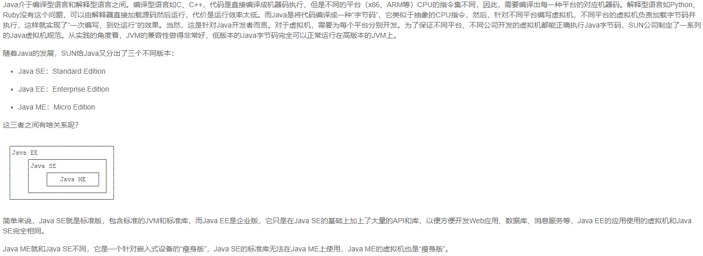
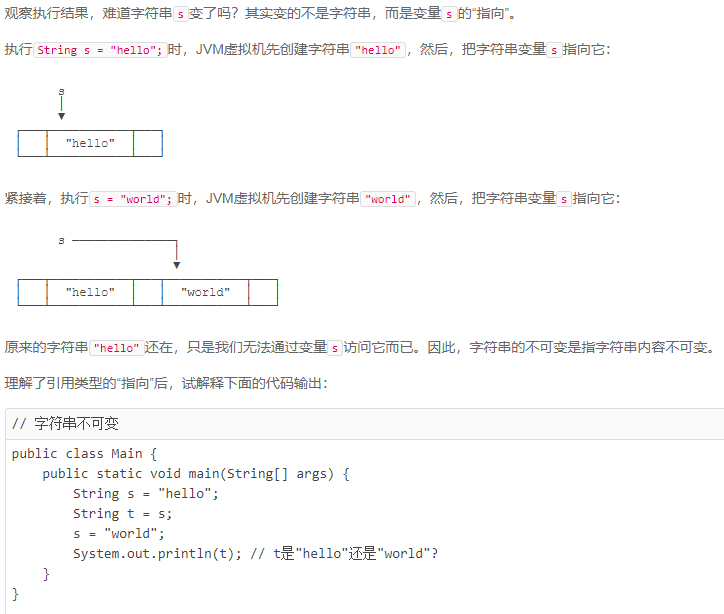
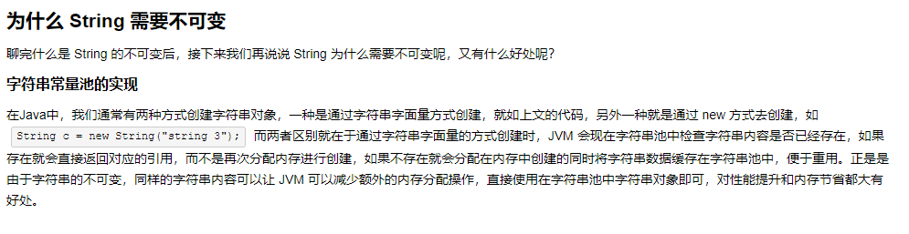
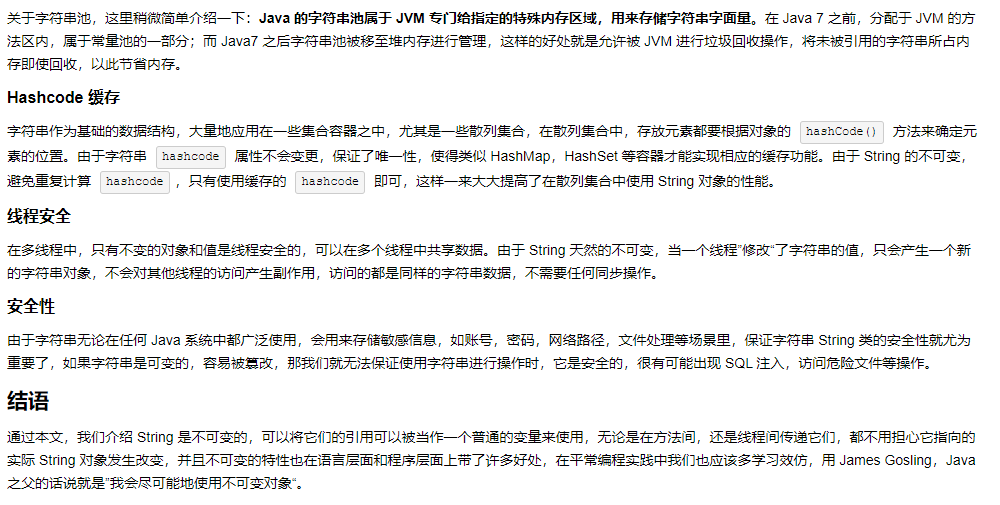
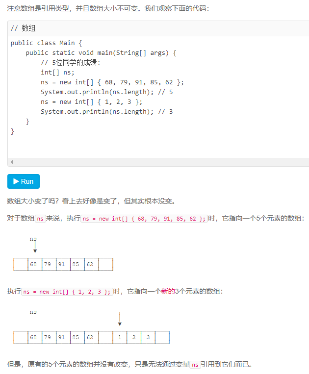
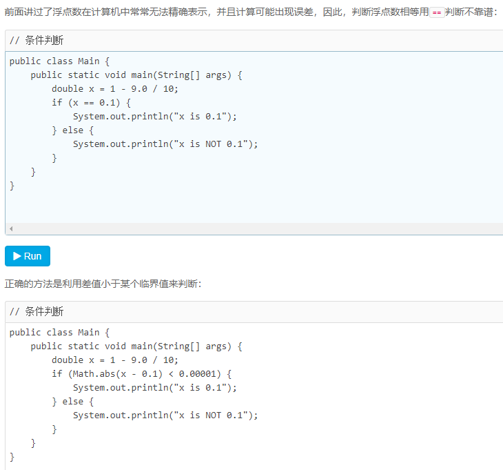
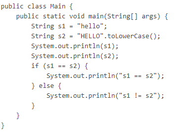
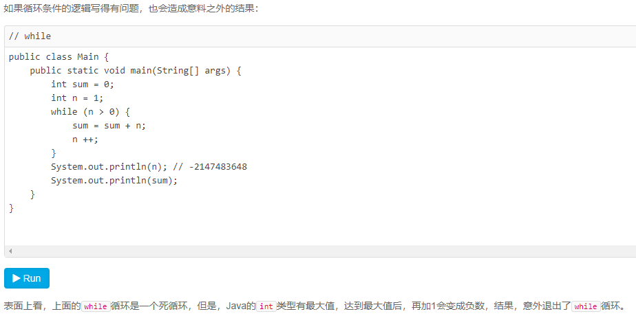
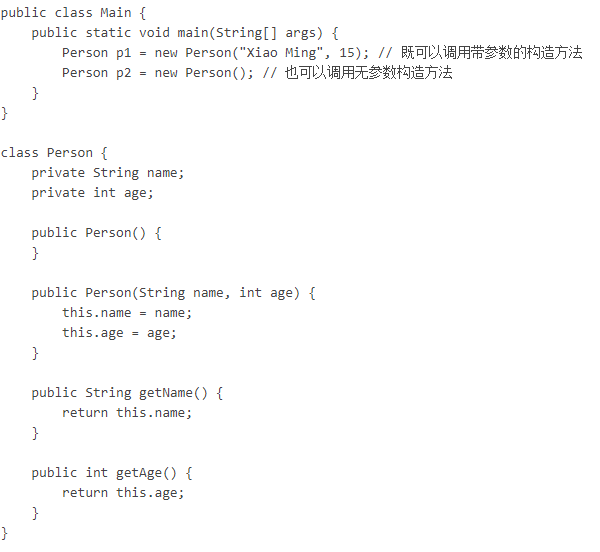
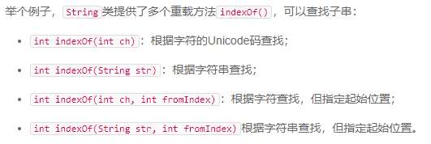

# Java学习笔记

#### 记录前重要提示
* 不会像之前系统学习ES6那样所有细节都掌握并练习
* 仅粗略记录以后需要用到的基本概念并理解即可，不用记录理解的内容，做到知道即可

#### 本周任务就完成ruoyi和mysql在本地的部署并尝试抄个接口出来即可，记录下环境搭建的过程
1. java环境安装  
2. mysql环境安装  
3. ruoyi系统服务端启动，端口配置修改  
4. ruoyi系统前端启动，端口配置修改  
5. 简单模仿写一套单表增删改查

## Java快速入门

### Java 之父 - 詹姆斯高斯林


### Java 程序基础
+ Java程序基础机构  
	- 类名必须以英文字母开头，后接字母，数字和下划线的组合  
	- 习惯以大写字母开头  
+ 变量和数据类型  
	- 整数类型 `byte/short/int/long`  
	- 浮点数类型 `float/double`  
	- 字符类型 `char`  
	- 布尔类型 `boolean`  
	- 引用类型，后面介绍类的概念时补充介绍  
	- 常量修饰符 `final`  
	- 关键字 `var` 根据赋值语句自动推出变量类型  
	- 变量作用域 {} 之间  
+ 整数运算  
+ 浮点数运算  
+ 布尔运算  
+ 字符和字符串  
	- 字符和字符串是不同的类型，`char`是基本数据类型，一个`char`保存一个`Unicode`字符；`string`是引用类型，用双引号`("...")`表示字符串，存储0到任意个字符  
	- 从`java13`开始，字符串可以用三引号`("""...""")`来表示多行字符串  
	- 字符串不可变，字符串值的变化实际上是引用地址的变化  
	-   
	-   
	-   
	- 引用类型的变量可以指向一个空值`null`，他表示不存在，即该变量不指向任何对象  
	- 注意要区分空值`null`和空字符串`("...")`，空字符串是一个有效的字符串对象，它不等于null  
+ 数组类型
	- `new int[5]` 表示创建于给可容纳5个`int`元素的数组  
	- 数组所有元素初始化为默认值，整型都是`0`，浮点型是`0.0`，布尔型是`false`  
	- 数组一旦创建后，大小就不可改变  
	- 数组是引用类型，在使用索引访问数组的时候如果超出索引运行时会报错  
	- 可以在定义数组的时候直接指定初始化的元素，这样不必写数组的大小，由编译器自动推算出数组大小  
	- 注意！！！数组也是不可变的  
	-   

### 流程控制
+ 输入和输出  
	- 输入比较简单，有一些表达式不做强记  
	- 输入需要以来`Scanner`包来引入函数操作  
+ if判断  
	- 浮点数在计算机中常常无法精确表示，并且计算可能出现误差，因此，判断浮点数相等用`==`判断不靠谱  
	-   
	- 两个String类型，它们的内容是相同的，但是，分别指向不同的对象，用`==`判断，结果为`false`  
	- 要判断引用类型的变量内容是否相等，必须使用`equals()`方法  
	-   
	- 如果两个变量使用`s1.equals(s2)`判断相等，如果其中`s1`为null，那么会报`NullPointerException`错误  
	- 要避免`NullPointerException`错误，可以先判断`s1`是否为null  
+ switch多重选择  
	- 从`Java12`开始，可以使用新的表达式语句  
	- 从`Java14`开始，可以使用`yield`关键字来返回值  
```
	switch(options){
		case option -> {
			yield code; // switch语句返回值
		};
	}
```
+ while循环  
	- `while`先判断循环条件再循环  
	- 如果循环条件永远满足，那这个循环就变成了死循环，死循环将导致***100%的CPU占用***，用户会感觉电脑运行缓慢，所以要避免编写死循环代码
	-   
+ do while循环  
	- `do while`是先循环再判断循环条件  
+ for循环  
	- `Java`中的`for each`循环无法指定遍历顺序，也无法获取数组的索引  
	- 提问：利用`for`循环求`π`，[参考链接评论区](https://www.liaoxuefeng.com/wiki/1252599548343744/1259540152578912#0)
+ break和continue  
	- `break`会跳出当前循环，也就是整个循环都不会执行了  
	- `continue`则是提前结束本次循环，直接继续执行下次循环，例如偶数不执行，奇数执行  

### 数组基础操作
+ 遍历数组  
	- 参数上面的`for`和`for each`  
+ 数组排序  
	- 参考并复习`js`以前学习的排序，后期工作一般用工具包解决  
+ 多维数组  
	- 简而言之就是数组的每一项里继续嵌套数组  
+ 命令行参数  
	- Java程序的入口是`main`方法，而`main`方法可以接受一个命令行参数，它是一个`String[]`数组  
	- 这个命令行参数由`JVM`接收用户输入并传给`main`方法  
	- 我们可以利用接收到的命令行参数，根据不同的参数执行不同的代码  

## 面向对象编程

### 面向对象基础
+ 方法  
	- 1个`class`包含多个`field`，使用`public`可能会破坏封装性，可以用`private`拒绝外部访问  
	- 在`class`内部使用`setField()`&`getField()`，这样外部代码可以间接修改`field`，并且可以在方法内部检查传入的参数是否符合要求  
	- 方法也分`publick`&`private`，`private`方法可以在方法内部调用，主要是内部操作参数  
	- 在方法内部，可以使用一个隐含的变量`this`，它始终指向当前实例，如果没有命名冲突，可以直接省略`this`，但是如果有局部变量重名，则必须加上`this`  
	- 方法可以包含0个或任意个参数，调用方法时，必须严格按照参数的定义顺序依次传递  
	- 还可以使用可变参数`变量类型...`，可变参数相当于数组类型，如`public void setNames(String... names){}`或`public void setNames(String[] names){}`  
	- 可变参数可以保证无法传入`null`，因为传入0个参数时，接收到的实际值是一个空数组而不是`null`
	- ***注意下面两个区别！！！***
	- 基本类型参数的传递，是调用方值的复制。双方各自的后续修改，互不影响  
	- 引用类型参数的传递，调用方的变量，和接收方的参数变量，指向的是同一个对象，双方任意一方对这个对象的修改，都会影响对方（因为指向同一个对象嘛）  
	- 基础数据类型，传递的是调用方值的拷贝  
	- 引用数据类型，传递是对象的引用  
	- 当参数为不可变对象（如String对象）时，调用方修改变量值只是将自己作用域下的变量指向了新的对象，不影响接收方的参数变量  
	- 当参数为可变对象（如Array对象）时，调用方修改变量值相当于自己作用域下的变量所指向的对象的值，影响接收方的参数变量  
+ 构造方法  
	- 创建实例，`类名 实例名 = new 类名(参数)`  
	- 由于构造方法是如此特殊，所以构造方法的名称就是类名  
	- 构造方法的参数没有限制，在方法内部，也可以编写任意语句，但是，和普通方法相比，构造方法没有返回值（也没有`void`），调用构造方法，必须用`new`操作符  
	- 任何`class`都有默认构造方法，创建实例，`类名 实例名 = new 类名()`  
	- 要特别注意的是，如果我们自定义了一个构造方法，那么，编译器就不再自动创建默认构造方法  
	- 如果既要能使用带参数的构造方法，又想保留不带参数的构造方法，那么只能把两个构造方法都定义出来  
	- 
	- 没有在构造方法中初始化字段时，`引用类型`的字段默认是`null`，`数值类型`的字段用默认值，`int类型`默认值是`0`，`布尔类型`默认值是`false`  
	- 可以定义多个构造方法，在通过`new`操作符调用的时候，编译器通过构造方法的参数数量、位置和类型自动区分（还可以这样 :] ）  
	- 
+ 方法重载  
	- 在一个类中，我们可以定义多个方法，这种方法名相同，但各自的参数不同，称为方法重载`Overload`  
	- 方法重载的返回值类型通常都是相同的  
	- 方法重载的目的是，功能类似的方法使用同一名字，更容易记住，因此，调用起来更简单  
	-   

#### =============================================================
# 20210624 应该是继续从这里学习，面向对象继续向下推进，继承那章节  
### 继承可以关联js的同步学习，对比以加深印象，[参考文章](https://www.cnblogs.com/yysbolg/p/11095901.html)  
#### =============================================================

+ 继承  
+ 多态  
+ 抽象类  
+ 接口  
+ 静态字段和静态方法  
+ 包  
+ 作用域  
+ 内部类  
+ classpath和jar  
+ 模块  

### Java核心类
+ 字符串和编码  
+ StringBuilder  
+ StringJoiner  
+ 包装类型  
+ JavaBean  
+ 枚举类  
+ 记录类  
+ BigInteger  
+ BigDecimal  
+ 常用工具类  

#### =============================================================
# 202106xx 上面的***面向对象***的学习内容还是要一边学一边写代码练习，代码存到`java-project -> java-pratice`  
## 下一个大章节 -> 异常处理
#### =============================================================
